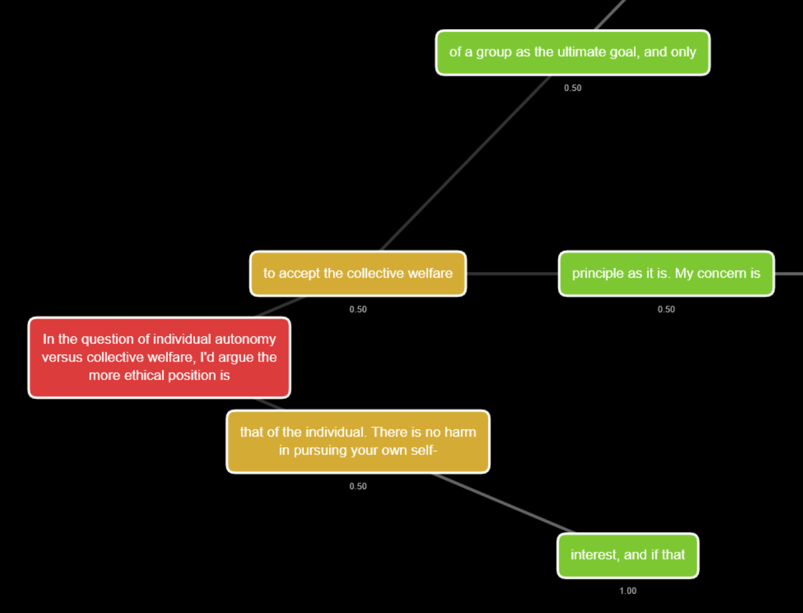

# Divergent Inference Architecture (DIA)

A work-in-progress tool for exploring the semantic branching behavior of language models, particularly when they encounter prompts that might lead to conflicting lines of reasoning.

## What This Does

Language model interfaces are typically optimized to produce a single "best" continuation from any given prompt. DIA attempts to identify conditions under which this optimzation fails: it generates many possible continuations, clusters them semantically, and builds a tree structure that reveals where the model's reasoning genuinely diverges toward multiple strong attractors.

This is based on the hypothesis that consumer-tuned models may still contain latent capabilities for statistically significant yet semantically conflicting inference chains - even if those chains are buried under safety training or preference optimization. By sampling broadly and clustering semantically similar continuations, we can potentially surface these alternative reasoning paths.

## Current State

This is very much a work in progress. The basic pipeline functions and can:

- Generate multiple continuation "stems" from branching points
- Create embeddings of stems using a sentence transformer model
- Cluster embeddings using a clustering algorhythm (DBSCAN or Heirarchical currently)
- Build an interactive tree visualization showing where semantic divergence is detected
- Display the stem clustering of each node as a 3D PCA projection, along with the text of all stems in the cluster.

## Limitations and TODOs

- Only tested on GPT-2 models, which aren't really intelligent enough to function as an actual proof of concept. (larger models will need better memory management)
- Clustering parameters need tuning for different domains.
- Currently no quantitative metrics for "semantic divergence". Debatable as to whether or not sentence embeddings constitute a valid evaluation of meaning.
- Visualization is bare-bones and could use more features/polish
- Data output is sparse at the moment. Could use more comprehensive stats.
- Limited testing on different model types and prompt categories

## Architecture

### Core Pipeline

- `divergent.py`: Main generation engine that orchestrates the semantic branching exploration
- `models/model_interface.py`: Abstract interface with factory functions for different language models
- `tree_utils.py`: Tree data structures (`TreeNode`) and operations (`TreeOperations`)

### Model Implementations

- `models/gpt_two.py`: GPT-2 interface with batched stem generation and sampling controls
- `models/mock_model.py`: Testing model that generates semantically clusterable stems

### Semantic Analysis

- `semantic_embedding/embedding_provider.py`: Abstract interface for text embeddings
- `semantic_embedding/sentence_embedding.py`: Sentence transformer implementation
- `semantic_embedding/mock_embedding.py`: Deterministic mock embeddings for testing
- `clustering/cluster_analyzer.py`: Abstract clustering interface with result structures
- `clustering/dbscan_clustering.py`: DBSCAN-based semantic clustering
- `clustering/hierarchical_clustering.py`: Hierarchical clustering implementation

### Visualization & Output

- `visualization/visualization.py`: HTML export and text-based tree printing
- `visualization/embedding_to_3d.py`: Converts high-dimensional embeddings to 3D PCA projections
- `templates/tree_template.html`: Interactive web visualization with 3D cluster viewer
- `reporting/analysis_report.py`: Comprehensive analysis results with JSON export

### Configuration & Utilities

- `config/config.py`: Centralized configuration management with automatic file discovery
- `config/config.ini`: Parameter settings for generation, clustering, and visualization
- `main.py`: Example usage and pipeline orchestration

This is experimental software. If you find it useful or have ideas for improvement, contributions are welcome.

## Possible Use Cases

- **Security research**: Identifying potential jailbreak vectors or unintended model behaviors
- **Model evaluation**: Understanding how alignment training affects latent model capabilities
- **Curiosity**: Exploring the "what if" space around contentious or ambiguous prompts

## Quick Start

TODO - add requirements.txt and quick start instructions

## Configuration

Edit `config.ini` to adjust:

- Model settings (currently supports GPT-2 variants)
- Generation parameters (temperature, top-k, top-p)
- Clustering sensitivity (eps, minimum cluster size)
- Visualization options
  TODO - more detail about config settings

## Architecture

#### Core Pipeline

- `divergent.py`: Main generation engine that orchestrates the semantic branching exploration
- `models/model_interface.py`: Abstract interface with factory functions for different language models
- `tree_utils.py`: Tree data structures (`TreeNode`) and operations (`TreeOperations`)

#### Model Implementations

- `models/gpt_two.py`: GPT-2 interface with batched stem generation and sampling controls

#### Semantic Analysis

- `semantic_embedding/embedding_provider.py`: Abstract interface for text embeddings
- `semantic_embedding/sentence_embedding.py`: Sentence transformer implementation
- `clustering/cluster_analyzer.py`: Abstract clustering interface with result structures
- `clustering/dbscan_clustering.py`: DBSCAN-based semantic clustering
- `clustering/hierarchical_clustering.py`: Hierarchical clustering implementation

#### Visualization & Output

- `visualization/visualization.py`: HTML export and text-based tree printing
- `visualization/embedding_to_3d.py`: Converts high-dimensional embeddings to 3D PCA projections
- `templates/tree_template.html`: Interactive web visualization with 3D cluster viewer
- `reporting/analysis_report.py`: Comprehensive analysis results with JSON export

#### Configuration & Utilities

- `config/config.py`: Centralized configuration management with automatic file discovery
- `config/config.ini`: Parameter settings for generation, clustering, and visualization
- `main.py`: Example usage and pipeline orchestration

## Why This Matters

Language models are increasingly deployed as single-response systems, but their training creates rich internal landscapes of possible continuations. Understanding these landscapes - especially where they contain conflicting reasoning patterns - seems important for both safety and capability assessment.

Whether this particular approach actually helps with that remains to be seen. Further testing and development is required.
