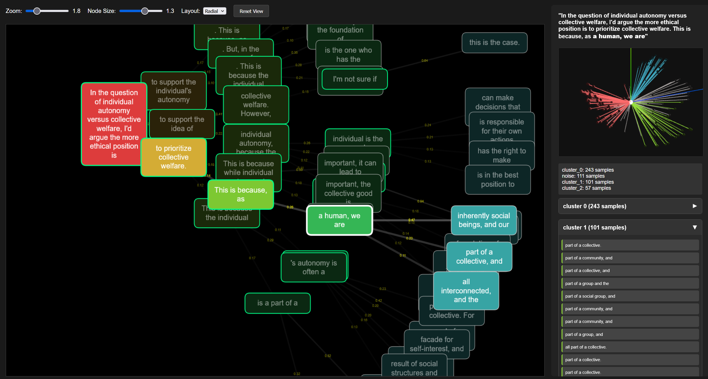

# Divergent Inference Analysis

A work-in-progress tool for exploring the semantic branching behavior of language models, particularly when they encounter prompts that might lead to conflicting lines of reasoning.

## What This Does

Language models trained on diverse text learn to represent multiple conflicting reasoning paths, but standard inference only surfaces one. This tool attempts to uncover latent structures in a model's internal landscape by giving it the same prompt multiple times and iteratively clustering the results into a graph of semantic nodes.

The goal is to reveal the primary ways in which a model might respond to a given prompt by filtering both trivial variations in phrasing, and low-probability noise. Ideally, this technique creates a set of responses that are meaningfully different from each other, while remaining statistically significant.

This project was created as a way to learn more about the inner workings of language models. I'm not sure if it has any practical applications, but it's a fun way to explore and compare their behaviors.

## Current State

This is very much a work in progress. The basic pipeline functions and will:

- Recursively generate multiple continuation "stems" and nodes from an initial prompt
- Prune stems based on abrupt jumps in token entropy
- Create semantic embeddings of stems using a sentence transformer model
- Group stem embeddings using a clustering algorithm (DBSCAN or Hierarchical currently)
- Select cluster representatives for continuation or branching
- Build an interactive html visualization showing where semantic divergence is detected
- Display the stem clustering of each node as a 3D PCA projection, along with the text of
  all stems in each cluster

## Possible Use Cases

- **Security Research**: Identifying potential jailbreak vectors or unintended model
  behaviors
- **Model Evaluation**: Understanding how alignment training affects latent model
  capabilities
- **Inference Prediction**: Identifying major semantic attractors in a prompt space
- **Curiosity**: Exploring the "what if" space around contentious or ambiguous prompts
- **Procedural Content Generation**: Dialog trees, story branching, etc.

## Quick Start

TODO - add requirements.txt and quick start instructions

## How to Use This

Configuration

Edit `config.ini` to adjust:

- Model settings (currently supports GPT-2 variants)
- Generation parameters (temperature, top-k, top-p)
- Clustering sensitivity (eps, minimum cluster size)
- Visualization options

TODO - more detail about config settings and general usage

## Limitations and TODOs

- Only tested on smaller models (<4B parameters), which may lack sufficient semantic comprehension to prove the concept. Improve memory management to make larger models more viable
- Inference, embedding, and clustering parameters need tuning for usable results in different prompts/domains
- Test performance of embeddings created with the cumulative chain of inference, rather than just individual stems
  - pooled with weighted mean favoring most recent stem?
- Currently, no quantitative measure of success: some standard or scoring metric should be established to distinguish a "good" evaluation of semantic divergence from a "poor" one
  - Distribution curve of samples among clusters?
  - Signal (clustered) to noise (unclustered) ratio?
  - Silhouette scoring?
- This tool can create the appearance of structures within sample data that do not meaningfully exist; aforementioned scoring should reflect confidence in an obvious and easy-to-read way to avoid misleading users.
- Metrics for detecting bad configurations and automated suggestions for improving them (monolithic clustering, samples too diverse for size of dataset, etc.)
- Depth-triggered branch clustering should be tested to validate semantic divergence is non-trivial at scales larger than stems (and to reduce redundant branching)
- Should use a log instead of just print statements
- Needs system prompts!
- Needs authentication/credential handling for gated models
- Needs config options for pooled embeddings (max, mean, etc.)
- Test linking stem entropy to clustering sensitivity
- Visualization is rudimentary and could use more QoL features/polish
- Data output is sparse at the moment. Could use more comprehensive stats
- Limited testing on different model types and prompt categories
- There are many places that could benefit from optimization and refactoring

## Feature Ideas
- **Search Function**: Allow text searching for specific phrases across a tree
- **Inter-prompt Comparison**: View differences between multiple variants of a prompt to identify subtle causes of semantic divergence
- **Live Visualization**: Allow live updating of the tree as the model generates new stems and create UI for directing where stems are generated and how they are clustered
- **Conversation/Instruct Mode**: Allow the user to input a prompt via UI. After tree is generated, allow the user to choose which leaf to respond at and continue generation from that point
- **Gradient Analysis**: Generate the dendrogram with a high degree of granularity and allow users to dynamically change clustering "cut depth" to view different degrees of divergence

## Architecture

#### Core Pipeline

- `divergent.py`: Main generation engine that orchestrates the semantic branching exploration
- `models/model_interface.py`: Abstract interface with factory functions for different language models
- `tree_utils.py`: Tree data structures (`TreeNode`) and operations (`TreeOperations`)

#### Model Implementations

- `models/gpt_two.py`: GPT-2 interface with batched stem generation and sampling controls

#### Semantic Analysis

- `semantic_embedding/embedding_provider.py`: Abstract interface for text embeddings
- `semantic_embedding/sentence_embedding.py`: Sentence transformer implementation
- `clustering/cluster_analyzer.py`: Abstract clustering interface with result structures
- `clustering/dbscan_clustering.py`: DBSCAN-based semantic clustering
- `clustering/hierarchical_clustering.py`: Hierarchical clustering implementation

#### Visualization & Output

- `visualization/visualization.py`: HTML export and text-based tree printing
- `visualization/embedding_to_3d.py`: Converts high-dimensional embeddings to 3D PCA projections
- `templates/tree_template.html`: Interactive web visualization with 3D cluster viewer
- `reporting/analysis_report.py`: Comprehensive analysis results with JSON export

#### Configuration & Utilities

- `config/config.py`: Centralized configuration management with automatic file discovery
- `config/config.ini`: Parameter settings for generation, clustering, and visualization
- `main.py`: Example usage and pipeline orchestration

This is experimental software. If you find it useful or have ideas for improvement, contributions are welcome.

## Why This Matters

Language models are increasingly deployed as single-response systems, but their training creates rich internal landscapes of possible continuations. Understanding these landscapes - especially where they contain conflicting reasoning patterns - seems important for both safety and capability assessment.

Whether this particular approach actually helps with that remains to be seen. Further testing and development is required.
